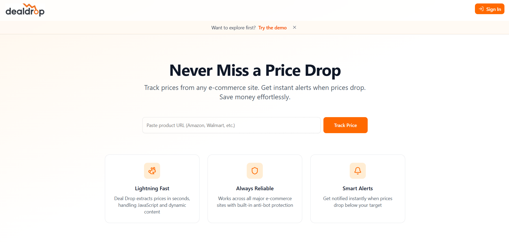
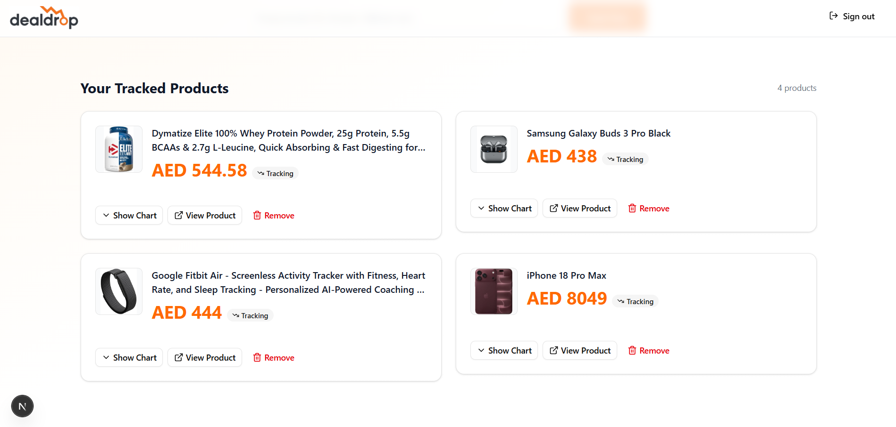
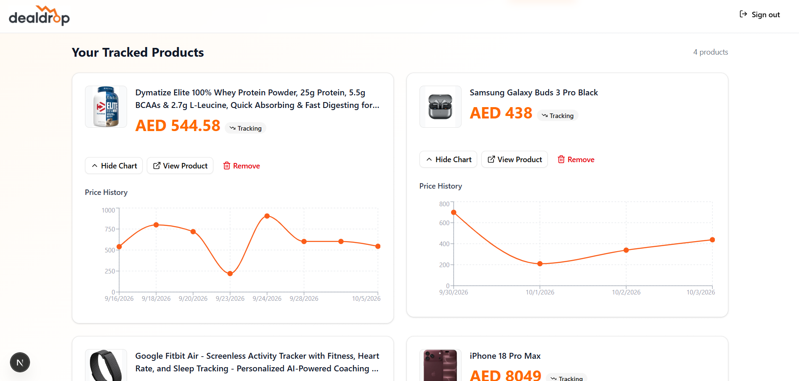

# DealDrop

DealDrop is a full-stack price tracking application that allows users to monitor products from e-commerce websites, track price changes over time, and receive email notifications when prices drop.

The application combines automated product scraping, scheduled price checks, interactive price history, and user authentication into a simple product monitoring experience.

**Live Demo:** https://thedealdrop.vercel.app  
**GitHub Repository:** https://github.com/mh5034/dealdrop

## Screenshots

### Home Page



### Tracked Products



### Price History



## Features

- **Product Tracking** — Add products using an e-commerce product URL and monitor their prices.
- **Automated Price Checks** — Scheduled background jobs periodically check tracked products for price changes.
- **Price Drop Alerts** — Users receive email notifications when a tracked product's price drops.
- **Price History** — View historical price changes through interactive charts.
- **User Authentication** — Secure authentication with Google OAuth and user-specific tracked products.
- **Demo Account** — Quickly explore the application's authenticated features without creating an account.
- **Responsive Interface** — Designed for desktop and mobile devices.

## Tech Stack

### Frontend & Application

- Next.js
- React
- TypeScript
- Tailwind CSS
- shadcn/ui
- Recharts

### Backend & Services

- Next.js Server Actions
- Supabase
- PostgreSQL
- Supabase Authentication
- Firecrawl
- Resend

### Deployment & Automation

- Vercel
- Scheduled cron jobs

## How It Works

1. A user submits the URL of a product they want to track.
2. DealDrop retrieves and processes the product information.
3. The product is saved to the authenticated user's tracked products.
4. Scheduled background jobs periodically check the product for updated pricing.
5. Each price check is stored to build the product's price history.
6. When a price drop is detected, DealDrop can notify the user by email.
7. Historical prices are displayed through an interactive chart so users can follow price changes over time.

## Architecture

DealDrop is built with Next.js and uses server-side functionality for operations that should not be exposed to the browser.

The application separates responsibilities between the UI, server-side actions, authentication, database operations, product data retrieval, and scheduled price checking.

```text id="p6t2c4"
User
 │
 ▼
Next.js / React
 │
 ├── Server Actions
 │
 ├── Supabase Auth
 │
 ├── PostgreSQL
 │
 ├── Product Data Retrieval
 │
 └── Scheduled Price Checks
          │
          ▼
      Email Alerts
```

Supabase provides authentication and persistent PostgreSQL storage, while scheduled jobs trigger automated product checks independently of normal user requests.

## Authentication

DealDrop uses Supabase Authentication to manage user sessions.

Google OAuth provides the primary authentication flow, and tracked products are associated with authenticated users so each user only interacts with their own product data.

A demo login is also available for visitors who want to explore the authenticated experience without creating an account.

## Price Tracking

When a product is tracked, DealDrop stores its product information and pricing data.

Scheduled requests periodically run the price-checking workflow. New prices are recorded as price history, allowing the application to determine whether the product's price has changed and display those changes over time.

## Price History

Price history is visualized using Recharts.

Each recorded price check contributes to the product's historical data, allowing users to inspect price changes through an interactive chart and view individual values through chart tooltips.

## Email Notifications

DealDrop integrates Resend to send automated email notifications.

When the price-checking workflow detects a qualifying price drop, an email alert can be sent to the user so they do not need to continuously check the application manually.

## Security

Sensitive operations and credentials are kept server-side using environment variables.

Authentication and database access are handled through Supabase, while server-side application logic prevents private credentials used by services such as product retrieval and email delivery from being exposed to the client.

## Running Locally

### 1. Clone the repository

```bash id="d92zdw"
git clone https://github.com/mh5034/dealdrop.git
cd dealdrop
```

### 2. Install dependencies

```bash id="mspt09"
npm install
```

### 3. Configure Environment Variables

Create a `.env.local` file in the project root and provide the required environment variables for:

- Supabase
- Resend
- Firecrawl
- Authentication
- Scheduled price checking

Do not commit `.env.local` or any private credentials to the repository.

### 4. Start the Development Server

```bash id="zzbgw4"
npm run dev
```

Then open:

```text id="v65v7h"
http://localhost:3000
```

## Production

DealDrop is deployed on Vercel.

The production environment contains the required environment variables and scheduled configuration used to execute automated price checks.

## Future Improvements

- More advanced price-change analytics
- Additional notification preferences
- Improved product data extraction across a wider range of retailers
- More detailed price-history filtering
- Additional dashboard insights
- Improved monitoring and error handling for automated price checks

## Author

**Mohammad Hadi Elabed**

Full-Stack Developer / Software Engineer